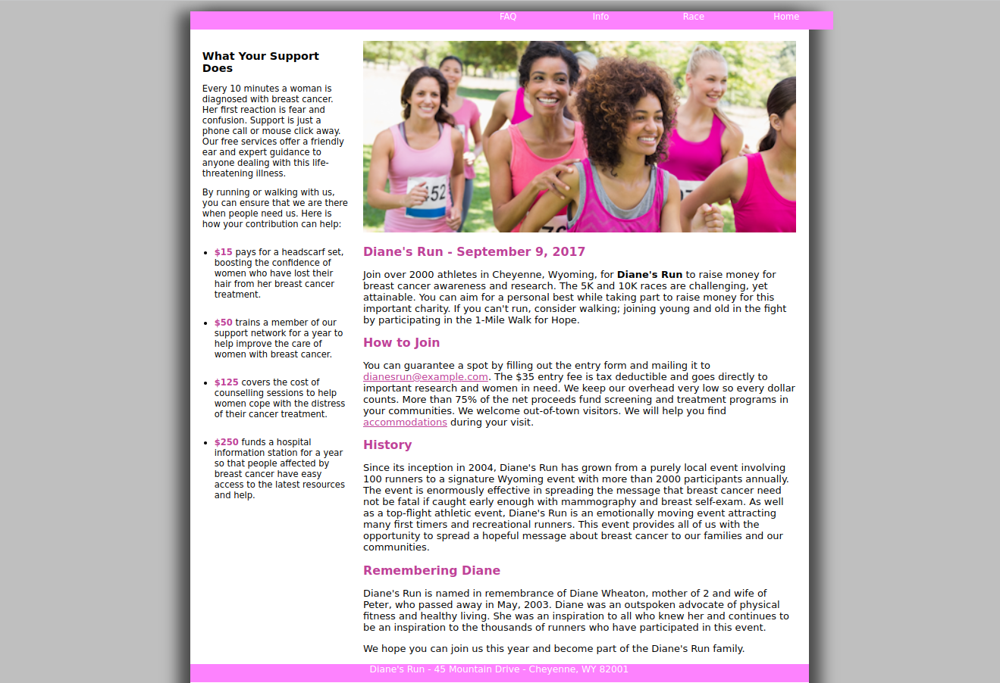

# T1 Case Problem 3: Diane's Run

[`Demo`](https://hesbon-osoro.github.io/DianesRun/)

## Summary

Diane's Run: Diane’s Run is a charity run to raise money for breast cancer awareness and research funding. Peter Wheaton is the charity run’s organizer and he has asked you to help modify the run’s website. He has revised text that he wants added to the current site.

The image above shows a preview of the company's home page that you'll create.

Peter has supplied you with the text content, the graphic images, and style sheets you need for the project. Your job will be to write HTML code for three pages: the site’s home page, a page containing race information, and finally a page containing a list of frequently asked questions (FAQ’s).

## Instructions

This Case Problem contains interactive instructions that you can complete to ensure you've completed the instruction correctly.

.
